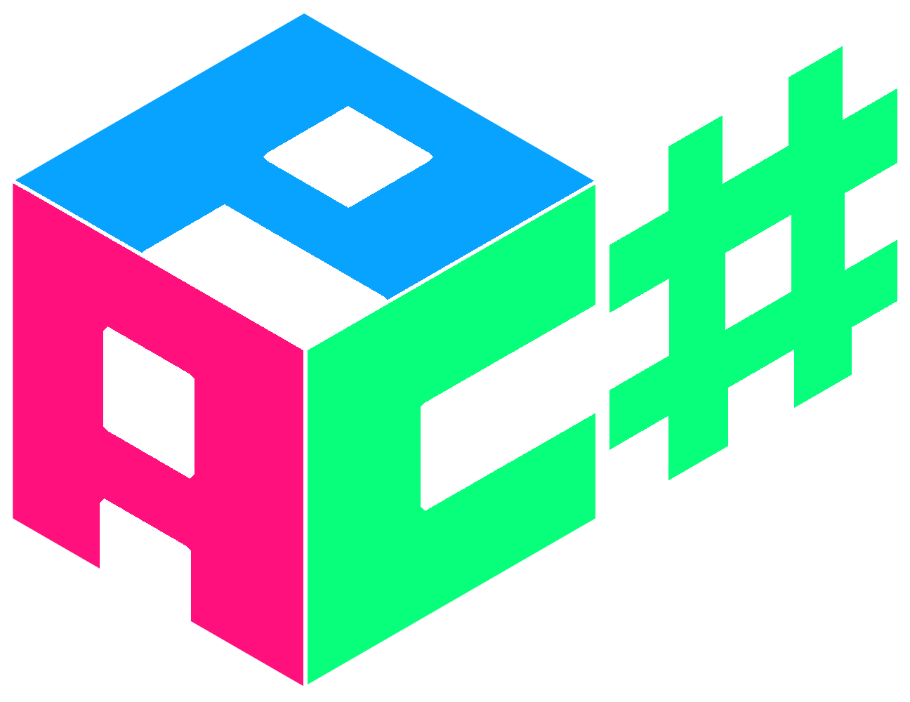

   
 
 

# Welcome!

**APC#** is *another parser combinator library* for building **flexible**, **lightweight** and **powerful** parsers in **C#**.

We design all APC parser libraries from scratch and with great care for developer experience. **APC#** is simple, safe, well documented, descriptive and user friendly error messages, fully customizable and fast.

The power comes from the declarative style of combinators, writing complex parsers in *just minutes* and a *few lines of code*, requiring no special tools to produce executable and release ready products. Parser combinators are more powerful than regular expressions, as they can parse a larger class of languages and are simpler and easier to use than *parser generators*.

You'll never need to doubt that the parser has some small bug or an edge-case you forgot in the design, we take care of that part. Skip the headache and *focus on the fun part*, designing parsers!

## Wow, I'm in!

Great! We'd recommend you to take a look at how you can [get started](articles/getting_started.html) in the best way possible!

## Want to contribute?

All help is very much appreciated! You can fork the repo right now and start building your own version right away, and if you happen to create something interesting and useful, don't hesitate to file a pull request!

See the project at [GitHub](https://github.com/WilliamRagstad/APCSharp) or at [NuGet](https://www.nuget.org/packages/APCSharp/).