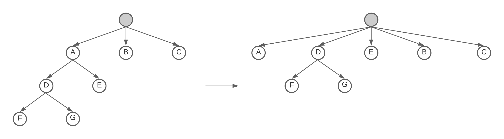

# Small fixes

Since the last update we noticed that some of our whitespace handling parser combinators was malfunctioning and caused a weird bug. This has been the main focus of this update, but we've added a new flatten combinator. The flatten combinator will take a tree with nodes with or without any child nodes, then create a new root element where every node with child nodes will have been flattened, meaning the child nodes are now directly under the root node together with the other element nodes.

## What changed?

* Fixed `ParserBuilder.IgnoredWhitespaces()` and will now works as intended.
* Fixed `ParserBuilder.AnyWhitespaces()` and now returns a single node with any trailing whitespace.
* Added `Combiner.Flatten` .
* Added `ParserBuilder.Flatten()` method.