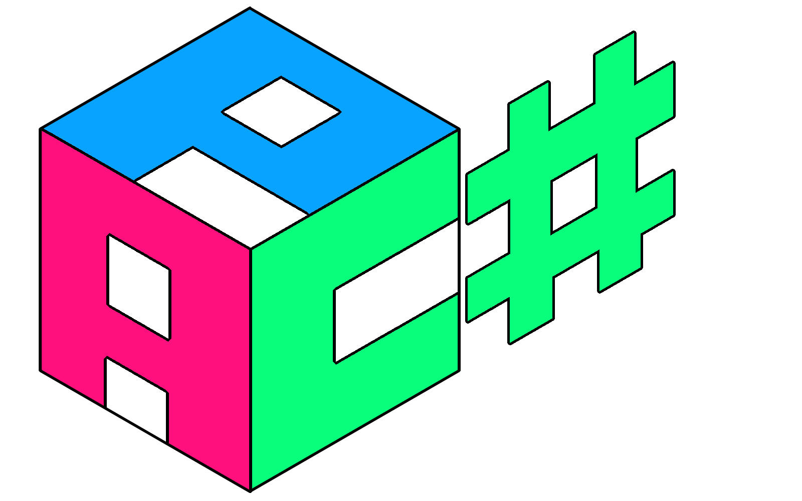

<div align="center">
 
    <p><b>Another Parser Combinator</b> <em>for <b>C#</b></em> is a library <br>
     for building optimized and flexible parsers.</p>
</div>


## Examples
This C# code below, creates a new parser, then using the `Run()` method to parse the input expression, and generate an AST.

```c#
Parser p = Parser.AnyOf(
        Parser.String("Programming"),
        Parser.String("Coding"),
        Parser.Word // Any string containing letters
    )
    .FollowedBy(
    	Parser.WhiteSpaces.Maybe() // Matches WhiteSpaces if there are any, else return an empty Node
	).RemoveEmptyMaybeMatches()	// Removes all empty Nodes
    .Many(); // Match every instance of: (<string/string/word> <whitespace?>)+

PResult r = p.Run(@"Coding
  is   cool!");
Console.WriteLine(r);
```
This produces the following output AST:

```text
PResult { Status: Succeeded, Remaining: "", AST:
    Node { Type: List, Children:
        Node { Type: List, Children:
            Node { Type: String, Value: "Coding" (System.String) }
            Node { Type: WhiteSpace, Value: "\r\n  " (System.String) }
        }
        Node { Type: List, Children:
            Node { Type: Word, Value: "is" (System.String) }
            Node { Type: WhiteSpace, Value: "   " (System.String) }
        }
        Node { Type: List, Children:
            Node { Type: Word, Value: "cool" (System.String) }
        }
    }
}
```


## Specification

| Description  | Value         |
| ------------ | ------------- |
| Framework    | .NET Core 3.1 |
| Package Size | 18 kB         |
| Semi-colons  | < 200         |


## Want to help?

All help is verry much appreciated! You can fork the repo right now and start building your own version right away, and if you happen to create something interesting and useful, don't hesitate to file a pull request!

### Sponsor this project

You can also help by supporting the project financially, all gifts are appreciated with great reverence and gratitude.

Developer: [paypal.me/williamragstad](http://paypal.me/williamragstad)
